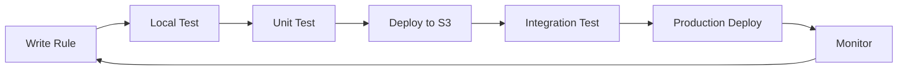

# 📋 Drools Rule Development Guide

## 📋 Table of Contents

- [Overview](#overview)
- [Rule Basics](#rule-basics)
- [Rule Structure](#rule-structure)
- [Development Workflow](#development-workflow)
- [Rule Examples](#rule-examples)
- [Best Practices](#best-practices)
- [Testing Rules](#testing-rules)
- [Troubleshooting](#troubleshooting)
- [Advanced Topics](#advanced-topics)

---

## 🎯 Overview

This guide covers how to develop, test, and deploy business rules for the Drools Rule Engine Microservice.

### Key Concepts
- **Rules**: Business logic written in Drools Rule Language (.drl)
- **Facts**: Java objects inserted into working memory
- **Working Memory**: Rule engine's data storage during execution
- **Agenda**: Queue of rule activations ready to fire

### Rule Engine Features
- **High Performance**: Optimized for 100-1000 RPS
- **Thread Safe**: Each execution uses isolated KieSession
- **Flexible**: Support for complex business logic
- **Cacheable**: Compiled rules cached for performance

---

## 📚 Rule Basics

### Rule Language (DRL)

Drools uses its own Domain Specific Language (DRL) for rule definition:

```drools
package com.company.rules.pricing

import java.util.Map

rule "Simple Discount Rule"
when
    $data : Map()
    eval($data.get("amount") instanceof Number)
    eval(((Number) $data.get("amount")).doubleValue() > 50)
then
    double amount = ((Number) $data.get("amount")).doubleValue();
    double discount = amount * 0.1; // 10% discount
    $data.put("discount", discount);
    $data.put("final_amount", amount - discount);
    $data.put("discount_applied", true);
end
```

### Rule Execution Flow
1. **Input Data**: JSON data converted to Map
2. **Fact Insertion**: Data inserted into working memory
3. **Pattern Matching**: Rule conditions evaluated
4. **Rule Firing**: Matching rules execute their actions
5. **Result Return**: Modified data returned as JSON

---

## 🏗️ Rule Structure

### Basic Rule Template

```drools
package com.company.rules.{domain}.{subdomain}

import java.util.Map
import java.util.List
import java.math.BigDecimal
// Additional imports as needed

rule "Rule Name"
    // Optional attributes
    salience 100          // Priority (higher fires first)
    no-loop true          // Prevent infinite loops
    agenda-group "group1" // Group rules for ordered execution
when
    // Conditions (Left Hand Side - LHS)
    $data : Map()
    // Pattern matching and constraints
then
    // Actions (Right Hand Side - RHS)
    // Modify data or perform operations
end
```

### Rule Attributes

| Attribute | Purpose | Example |
|-----------|---------|---------|
| `salience` | Rule priority (higher fires first) | `salience 100` |
| `no-loop` | Prevent rule from firing again on its own changes | `no-loop true` |
| `agenda-group` | Group rules for ordered execution | `agenda-group "validation"` |
| `activation-group` | Only one rule in group can fire | `activation-group "discount"` |
| `ruleflow-group` | Control rule execution flow | `ruleflow-group "pricing"` |

### Package Structure

Organize rules hierarchically matching your S3 bucket structure:

```
S3 Bucket Structure:
├── pricing/
│   ├── discount/
│   │   ├── vip.drl
│   │   ├── seasonal.drl
│   │   └── bulk.drl
│   ├── tax/
│   │   ├── us.drl
│   │   └── international.drl
└── compliance/
    ├── sanctions/
    │   └── ofac.drl
    └── kyc/
        └── customer-verification.drl

Rule IDs:
- pricing.discount.vip
- pricing.discount.seasonal
- pricing.tax.us
- compliance.sanctions.ofac
```

---

## 🔄 Development Workflow

### 1. Rule Development Lifecycle



### 2. Local Development Setup

```bash
# Create rule directory structure
mkdir -p rules/pricing/discount
mkdir -p rules/compliance/sanctions

# Create sample rule
cat > rules/pricing/discount/vip.drl << 'EOF'
package com.company.rules.pricing.discount

import java.util.Map

rule "VIP Customer Discount"
    salience 100
when
    $data : Map()
    eval($data.get("customer_type") != null)
    eval("VIP".equals($data.get("customer_type")))
    eval($data.get("amount") instanceof Number)
then
    double amount = ((Number) $data.get("amount")).doubleValue();
    double discountRate = 0.20; // 20% discount for VIP
    double discount = amount * discountRate;
    
    $data.put("discount_rate", discountRate);
    $data.put("discount", discount);
    $data.put("final_amount", amount - discount);
    $data.put("vip_discount_applied", true);
    
    System.out.println("Applied VIP discount: " + discount);
end
EOF
```

### 3. Rule Deployment

```bash
# Deploy to LocalStack (development)
aws --endpoint-url=http://localhost:4566 s3 cp rules/ s3://local-rules/ --recursive

# Deploy to Production S3
aws s3 cp rules/ s3://prod-drools-rules/ --recursive

# Refresh specific rule via API
curl -X POST http://localhost:8081/admin/refresh-rules/pricing.discount.vip

# Refresh all rules
curl -X POST http://localhost:8081/admin/refresh-rules
```

---

## 💡 Rule Examples

### 1. Simple Pricing Rule

```drools
package com.company.rules.pricing

import java.util.Map

rule "Basic Pricing Calculation"
when
    $data : Map()
    eval($data.get("quantity") instanceof Number)
    eval($data.get("unit_price") instanceof Number)
then
    int quantity = ((Number) $data.get("quantity")).intValue();
    double unitPrice = ((Number) $data.get("unit_price")).doubleValue();
    double totalAmount = quantity * unitPrice;
    
    $data.put("total_amount", totalAmount);
    $data.put("pricing_rule_applied", "basic");
end
```

### 2. Tiered Discount Rule

```drools
package com.company.rules.pricing.discount

import java.util.Map

rule "Bulk Discount Tier 1"
    salience 90
when
    $data : Map()
    eval($data.get("quantity") instanceof Number)
    eval(((Number) $data.get("quantity")).intValue() >= 10)
    eval(((Number) $data.get("quantity")).intValue() < 50)
    eval($data.get("total_amount") instanceof Number)
then
    double amount = ((Number) $data.get("total_amount")).doubleValue();
    double discount = amount * 0.05; // 5% discount
    
    $data.put("bulk_discount_tier", 1);
    $data.put("bulk_discount", discount);
    $data.put("final_amount", amount - discount);
end

rule "Bulk Discount Tier 2"
    salience 100
when
    $data : Map()
    eval($data.get("quantity") instanceof Number)
    eval(((Number) $data.get("quantity")).intValue() >= 50)
    eval($data.get("total_amount") instanceof Number)
then
    double amount = ((Number) $data.get("total_amount")).doubleValue();
    double discount = amount * 0.15; // 15% discount
    
    $data.put("bulk_discount_tier", 2);
    $data.put("bulk_discount", discount);
    $data.put("final_amount", amount - discount);
end
```

### 3. Conditional Logic Rule

```drools
package com.company.rules.validation

import java.util.Map
import java.util.ArrayList

rule "Customer Validation"
when
    $data : Map()
    eval($data.get("customer_age") instanceof Number)
    eval($data.get("customer_type") != null)
then
    int age = ((Number) $data.get("customer_age")).intValue();
    String customerType = (String) $data.get("customer_type");
    ArrayList<String> validationErrors = new ArrayList<String>();
    
    // Age validation
    if (age < 18) {
        validationErrors.add("Customer must be at least 18 years old");
    }
    
    // Customer type validation
    if (!"STANDARD".equals(customerType) && 
        !"VIP".equals(customerType) && 
        !"PREMIUM".equals(customerType)) {
        validationErrors.add("Invalid customer type: " + customerType);
    }
    
    // VIP age requirement
    if ("VIP".equals(customerType) && age < 25) {
        validationErrors.add("VIP customers must be at least 25 years old");
    }
    
    $data.put("validation_errors", validationErrors);
    $data.put("validation_passed", validationErrors.isEmpty());
end
```

### 4. Date-based Rule

```drools
package com.company.rules.pricing.seasonal

import java.util.Map
import java.time.LocalDate
import java.time.Month

rule "Black Friday Discount"
    salience 150
when
    $data : Map()
    eval($data.get("amount") instanceof Number)
    eval(isBlackFridayPeriod())
then
    double amount = ((Number) $data.get("amount")).doubleValue();
    double discount = amount * 0.30; // 30% Black Friday discount
    
    $data.put("seasonal_discount", discount);
    $data.put("seasonal_discount_type", "BLACK_FRIDAY");
    $data.put("final_amount", amount - discount);
end

function boolean isBlackFridayPeriod() {
    LocalDate today = LocalDate.now();
    // Black Friday is the fourth Thursday of November
    // Simplified: check if November 20-30
    return today.getMonth() == Month.NOVEMBER && 
           today.getDayOfMonth() >= 20 && 
           today.getDayOfMonth() <= 30;
}
```

### 5. Complex Business Logic

```drools
package com.company.rules.compliance.sanctions

import java.util.Map
import java.util.List
import java.util.Arrays

rule "OFAC Sanctions Screening"
    salience 1000  // High priority for compliance
when
    $data : Map()
    eval($data.get("customer_name") != null)
    eval($data.get("country") != null)
then
    String customerName = ((String) $data.get("customer_name")).toUpperCase();
    String country = (String) $data.get("country");
    
    // Simplified sanctions check (in real implementation, use proper API)
    List<String> sanctionedCountries = Arrays.asList(
        "COUNTRY_A", "COUNTRY_B", "COUNTRY_C"
    );
    
    List<String> sanctionedNames = Arrays.asList(
        "SANCTIONED_PERSON_1", "SANCTIONED_ENTITY_1"
    );
    
    boolean countryFlagged = sanctionedCountries.contains(country.toUpperCase());
    boolean nameFlagged = sanctionedNames.stream()
        .anyMatch(name -> customerName.contains(name));
    
    $data.put("sanctions_check_performed", true);
    $data.put("country_flagged", countryFlagged);
    $data.put("name_flagged", nameFlagged);
    $data.put("sanctions_clear", !countryFlagged && !nameFlagged);
    
    if (countryFlagged || nameFlagged) {
        $data.put("requires_manual_review", true);
        $data.put("compliance_status", "FLAGGED");
    } else {
        $data.put("compliance_status", "CLEAR");
    }
end
```

---

## 🎯 Best Practices

### 1. Rule Design Principles

#### Single Responsibility
```drools
// Good: One responsibility per rule
rule "Calculate Base Price"
when
    $data : Map()
    eval($data.get("quantity") != null)
    eval($data.get("unit_price") != null)
then
    // Calculate base price only
end

rule "Apply VIP Discount"
when
    $data : Map()
    eval($data.get("customer_type") != null)
    eval("VIP".equals($data.get("customer_type")))
then
    // Apply discount only
end
```

#### Avoid Complex Conditions
```drools
// Bad: Complex, hard to maintain
rule "Complex Validation"
when
    $data : Map()
    eval($data.get("age") instanceof Number && 
         ((Number) $data.get("age")).intValue() >= 18 && 
         ((Number) $data.get("age")).intValue() <= 65 &&
         $data.get("income") instanceof Number &&
         ((Number) $data.get("income")).doubleValue() > 50000 &&
         "PREMIUM".equals($data.get("customer_type")))
then
    // Complex logic
end

// Good: Use functions for complex logic
rule "Premium Customer Validation"
when
    $data : Map()
    eval(isEligiblePremiumCustomer($data))
then
    // Simple action
end

function boolean isEligiblePremiumCustomer(Map data) {
    // Extract complex logic to function
    if (!(data.get("age") instanceof Number)) return false;
    int age = ((Number) data.get("age")).intValue();
    
    if (!(data.get("income") instanceof Number)) return false;
    double income = ((Number) data.get("income")).doubleValue();
    
    return age >= 18 && age <= 65 && 
           income > 50000 && 
           "PREMIUM".equals(data.get("customer_type"));
}
```

### 2. Performance Optimization

#### Use Salience for Priority
```drools
// High priority rules first
rule "Security Check"
    salience 1000
when
    // Security validation
then
    // Block if security fails
end

rule "Business Logic"
    salience 100
when
    // Main business logic
then
    // Process normally
end
```

#### Prevent Infinite Loops
```drools
rule "Price Calculation"
    no-loop true  // Prevent re-firing on own modifications
when
    $data : Map()
    eval($data.get("price_calculated") == null)
then
    // Calculate price
    $data.put("price_calculated", true);
end
```

### 3. Error Handling

#### Null Checks
```drools
rule "Safe Amount Processing"
when
    $data : Map()
    eval($data.get("amount") != null)
    eval($data.get("amount") instanceof Number)
then
    double amount = ((Number) $data.get("amount")).doubleValue();
    // Process amount safely
end
```

#### Validation Rules
```drools
rule "Input Validation"
    salience 999  // Run validation first
when
    $data : Map()
then
    ArrayList<String> errors = new ArrayList<String>();
    
    if ($data.get("customer_id") == null) {
        errors.add("customer_id is required");
    }
    
    if ($data.get("amount") == null || !($data.get("amount") instanceof Number)) {
        errors.add("amount must be a valid number");
    }
    
    if (!errors.isEmpty()) {
        $data.put("validation_errors", errors);
        $data.put("processing_stopped", true);
    }
end
```

### 4. Maintainability

#### Use Meaningful Names
```drools
// Good: Descriptive rule names
rule "Apply Senior Citizen Discount for Medical Products"
rule "Validate Credit Card Expiration Date"
rule "Calculate Shipping Cost for International Orders"

// Bad: Generic names
rule "Rule 1"
rule "Discount Rule"
rule "Validation"
```

#### Document Complex Logic
```drools
rule "Complex Tax Calculation"
    // This rule calculates tax based on:
    // 1. Customer location (state tax rates)
    // 2. Product category (tax exemptions)
    // 3. Purchase amount (tax brackets)
when
    $data : Map()
    // Conditions
then
    // Well-commented actions
end
```

---

## 🧪 Testing Rules

### 1. Unit Testing with Drools Test Framework

Create test files in `src/test/resources/rules/`:

```java
// RuleTest.java
@RunWith(DroolsJUnit4Runner.class)
public class PricingRuleTest {
    
    @Test
    @DroolsSession("pricing-rules")
    public void testVipDiscount() {
        Map<String, Object> data = new HashMap<>();
        data.put("amount", 100.0);
        data.put("customer_type", "VIP");
        
        ksession.insert(data);
        ksession.fireAllRules();
        
        assertEquals(80.0, data.get("final_amount"));
        assertEquals(20.0, data.get("discount"));
        assertEquals(true, data.get("vip_discount_applied"));
    }
}
```

### 2. API Testing

```bash
# Test rule execution via API
curl -X POST http://localhost:8080/execute-rule \
  -H "Content-Type: application/json" \
  -d '{
    "rule_id": "pricing.discount.vip",
    "data": {
      "amount": 100,
      "customer_type": "VIP"
    }
  }'

# Expected response:
{
  "rule_id": "pricing.discount.vip",
  "result": {
    "amount": 100,
    "customer_type": "VIP",
    "discount": 20.0,
    "final_amount": 80.0,
    "vip_discount_applied": true
  },
  "error": null,
  "execution_time_ms": 15
}
```

### 3. Load Testing Rules

```javascript
// k6 load test script
import http from 'k6/http';
import { check } from 'k6';

export let options = {
  stages: [
    { duration: '30s', target: 100 },
    { duration: '1m', target: 500 },
    { duration: '30s', target: 0 },
  ],
};

export default function() {
  let payload = JSON.stringify({
    rule_id: 'pricing.discount.vip',
    data: {
      amount: Math.random() * 1000,
      customer_type: 'VIP'
    }
  });
  
  let response = http.post('http://localhost:8080/execute-rule', payload, {
    headers: { 'Content-Type': 'application/json' },
  });
  
  check(response, {
    'status is 200': (r) => r.status === 200,
    'response time < 100ms': (r) => r.timings.duration < 100,
  });
}
```

---

## 🔍 Troubleshooting

### Common Issues

#### 1. Rule Compilation Errors

```drools
// Error: Syntax error
rule "Bad Rule"
when
    $data : Map()
    eval($data.get("amount") > 100)  // Error: type mismatch
then
    // Actions
end

// Fix: Proper type checking
rule "Good Rule"
when
    $data : Map()
    eval($data.get("amount") instanceof Number)
    eval(((Number) $data.get("amount")).doubleValue() > 100)
then
    // Actions
end
```

#### 2. Performance Issues

```drools
// Slow: Complex pattern matching
rule "Slow Rule"
when
    $data : Map()
    eval(complexFunction($data) && anotherComplexFunction($data))
then
    // Actions
end

// Better: Cache function results
rule "Optimized Rule"
when
    $data : Map()
    eval(isEligible($data))  // Single function call
then
    // Actions
end

function boolean isEligible(Map data) {
    // Combine complex logic, cache results if needed
    return complexFunction(data) && anotherComplexFunction(data);
}
```

### Debugging Tips

#### 1. Add Debug Logging

```drools
rule "Debug Rule"
when
    $data : Map()
then
    System.out.println("Rule fired with data: " + $data);
    // Your logic here
    System.out.println("Rule completed, result: " + $data.get("result"));
end
```

#### 2. Use Rule Audit

```java
// Enable audit logging
StatelessKieSession session = kieBase.newStatelessKieSession();
KieRuntimeLogger logger = KieServices.Factory.get()
    .getLoggers()
    .newConsoleLogger(session);

session.execute(facts);
logger.close();
```

#### 3. Monitor Rule Execution

```bash
# Check rule execution metrics
curl http://localhost:8081/admin/rules

# Check health status
curl http://localhost:8081/admin/health

# View logs
tail -f /var/log/drools-rule-engine/application.log | grep "rule_id"
```

---

## 🚀 Advanced Topics

### 1. Rule Templates

Create parameterized rules for similar logic:

```drools
template header
discount_rate
customer_type
min_amount

package com.company.rules.pricing.discount;

template "Customer Discount"

rule "Apply @{customer_type} Discount"
when
    $data : Map()
    eval("@{customer_type}".equals($data.get("customer_type")))
    eval($data.get("amount") instanceof Number)
    eval(((Number) $data.get("amount")).doubleValue() >= @{min_amount})
then
    double amount = ((Number) $data.get("amount")).doubleValue();
    double discount = amount * @{discount_rate};
    $data.put("discount", discount);
    $data.put("final_amount", amount - discount);
end

end template
```

### 2. Decision Tables

Use Excel or CSV for rule management:

```csv
RuleTable Customer Discounts
customer_type,min_amount,discount_rate
VIP,0,0.20
PREMIUM,100,0.15
STANDARD,500,0.10
```

### 3. Rule Flows

Control rule execution order:

```xml
<!-- pricing-flow.rf -->
<process xmlns="http://drools.org/drools-5.0/process"
         name="PricingFlow" 
         id="pricing-flow">
  
  <start name="Start" />
  
  <ruleSet name="Validation Rules" 
           ruleFlowGroup="validation" />
  
  <ruleSet name="Pricing Rules" 
           ruleFlowGroup="pricing" />
  
  <ruleSet name="Discount Rules" 
           ruleFlowGroup="discounts" />
  
  <end name="End" />
</process>
```

### 4. Rule Versioning

Implement rule versioning strategy:

```
S3 Structure:
├── rules/
│   ├── v1/
│   │   ├── pricing/
│   │   └── compliance/
│   ├── v2/
│   │   ├── pricing/
│   │   └── compliance/
│   └── current/  # Symlink to latest version
```

---

## 📚 Additional Resources

### Documentation
- [Drools Documentation](https://docs.drools.org/)
- [Rule Language Reference](https://docs.drools.org/7.74.1.Final/drools-docs/html_single/#drl-rules-con_drl-rules)
- [Pattern Matching Guide](https://docs.drools.org/7.74.1.Final/drools-docs/html_single/#drl-patterns-con_drl-rules)

### Tools
- [Drools Workbench](https://docs.drools.org/7.74.1.Final/drools-docs/html_single/#_droolsworkbench)
- [Rule Testing Framework](https://docs.drools.org/7.74.1.Final/drools-docs/html_single/#_testing_rules)
- [Visual Rule Builder](https://docs.drools.org/7.74.1.Final/drools-docs/html_single/#_visual_rule_builder)

### Examples Repository
- [Sample Rules](../rules/)
- [Test Cases](../src/test/resources/rules/)
- [Performance Benchmarks](../performance/)

---

**Last Updated**: 2025-07-22  
**Version**: 1.0.0